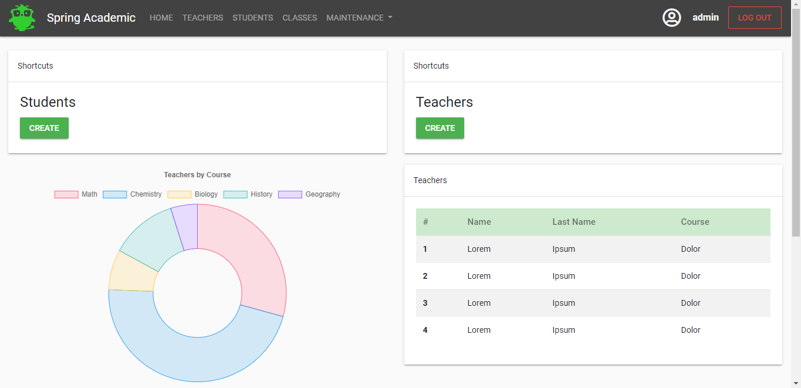

# SpringAcademic
This is a sample project. It was made for academic and demonstrational purposes only and should not be taken otherwise.
 
 

## Technologies and Concepts Used
- Spring Boot
- Spring MVC
- Spring Security
- RESTful APIs
- Heroku (deployment)

## Inspiration
This app is based on a thesis made by Eloísa Alés Esquivel. [Here's the link to the original PDF file](http://bibing.us.es/proyectos/abreproy/12358/fichero/MemoriaPFC.pdf).
